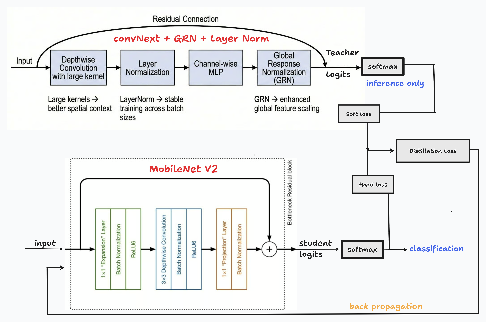

# Edge-Efficient Knowledge-Distilled Hybrid Vision–Language System for Plant Disease Diagnosis

This project presents an edge-efficient hybrid Vision–Language framework for intelligent plant disease diagnosis and smart farming guidance. A lightweight MobileNetV2 student model, trained via knowledge distillation from a high-capacity teacher network, performs low-FLOPs leaf image classification. The distilled architecture enables accurate disease prediction while maintaining computational efficiency suitable for edge and resource-constrained environments.

The predicted disease label and confidence score are integrated with a locally hosted large language model using Ollama, forming a hybrid CNN–LLM pipeline. This reasoning layer generates structured agricultural advisory reports, including disease summaries, causes, treatment recommendations (organic and chemical), prevention strategies, and severity assessment.

By combining efficient computer vision with contextual language reasoning, this system extends traditional plant disease classifiers into intelligent decision-support tools for practical, explainable, and scalable smart farming applications.

## Architecture

## Repository Structure

- **KD distillation model + Ollama implementation.ipynb**: The core implementation notebook containing the Knowledge Distillation training process and the integration pipeline with the Ollama LLM for generating reports.
- **ollama_helper.py**: A utility script to handle interactions with the local Ollama instance, sending the classification results and retrieving structured agricultural advice.
- **Comparison of 6 TL models.ipynb**: A comparative study of various Transfer Learning models to benchmark performance.
- **Two MobileNetV2 Students (Ensemble).ipynb**: Experiments with an ensemble of MobileNetV2 student models for improved accuracy.

## Contributors

1. [Sajeev Senthil](https://github.com/SajeevSenthil/)
2. [Jerome Richard](https://github.com/FightKlub)
3. [Joseph Binu](https://github.com/Josephbinu05)
4. [Hari Vaarthan T D](https://github.com/hari23228/hari23228)